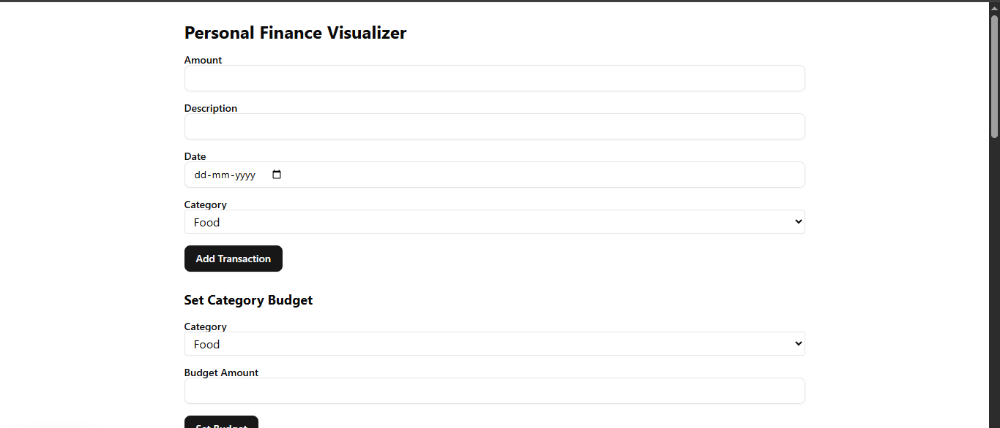
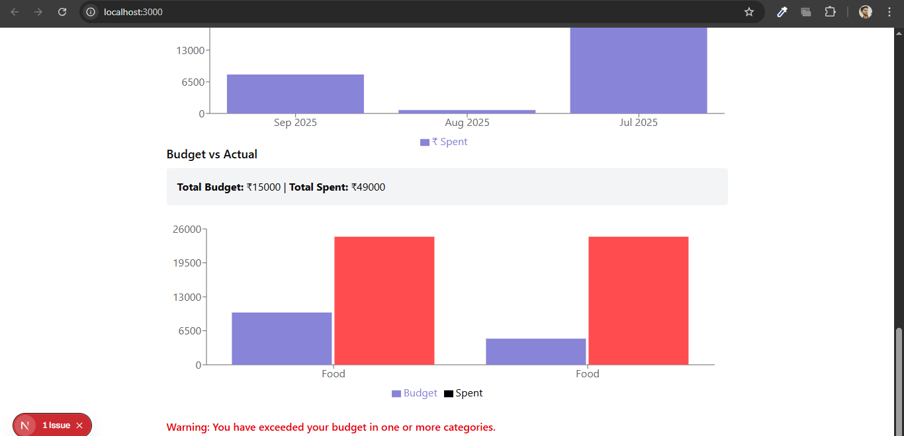
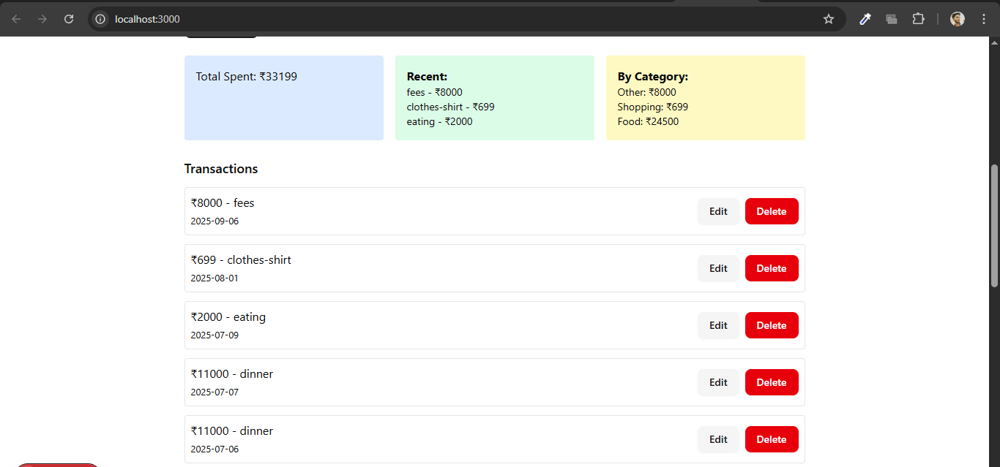
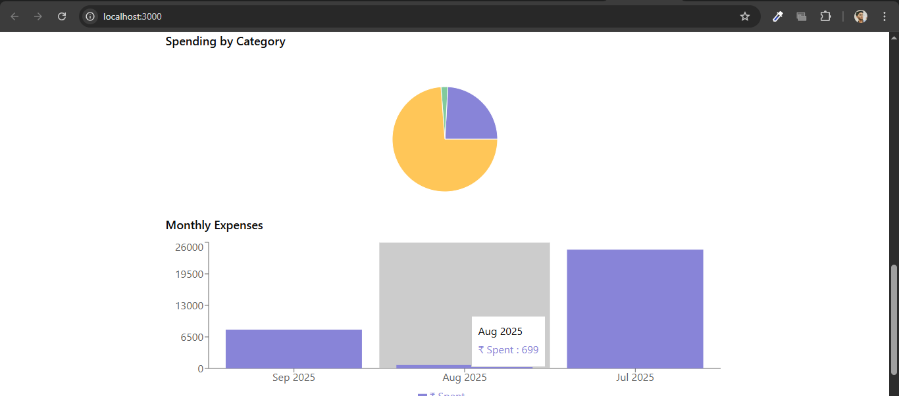

# 💸 Personal Finance Visualizer

A simple, full-featured personal finance tracker built with **Next.js**, **React**, **MongoDB**, **Recharts**, and **shadcn/ui**. Track expenses, categorize transactions, set budgets, and visualize spending insights — all without login/signup.

---

## 🚀 Features

### ✅ Stage 1: Basic Transaction Tracking

* Add/Edit/Delete transactions
* Transaction list view
* Monthly expenses bar chart
* Basic form validation

### ✅ Stage 2: Categories

* Predefined transaction categories
* Category-wise expense pie chart
* Summary cards:

  * 💰 Total expenses
  * 🧾 Category breakdown
  * 🕑 Recent transactions

### ✅ Stage 3: Budgeting

* Set monthly budgets per category
* Budget vs actual comparison chart
* Visual alerts for overspending
* Simple spending insights (total budget/spent)

---

## 🛠 Tech Stack

* **Frontend**: Next.js 15, React 19, TailwindCSS (via `shadcn/ui`)
* **Charts**: [Recharts](https://recharts.org/)
* **Database**: MongoDB (via MongoDB Atlas)
* **API Routes**: Next.js server actions
* **State**: React Hooks
* **Validation**: HTML5 & simple conditional logic

---

## 📂 Folder Structure

```
personal-finance-visualizer/
├── app/
│   ├── api/
│   │   ├── transactions/
│   │   │   └── route.ts
│   │   └── budgets/
│   │       └── route.ts
│   ├── layout.tsx
│   ├── page.tsx
│   └── globals.css
├── components/
│   ├── TransactionForm.tsx
│   ├── TransactionList.tsx
│   ├── CategoryChart.tsx
│   ├── BudgetForm.tsx
│   ├── BudgetChart.tsx
│   └── SummaryCards.tsx
├── models/
│   ├── Transaction.ts
│   └── Budget.ts
└── utils/
    └── db.ts
```

---

## 📸 Screenshots

      
   

---

## 🔧 How to Run Locally

```bash
git clone https://github.com/your-username/personal-finance-visualizer.git
cd personal-finance-visualizer
npm install
npm run dev
```

Create a `.env.local` file with:

```env
MONGODB_URI=your-mongodb-atlas-uri
```

---

## 🌐 Live Demo

**🔗 [Your Vercel Link Here](https://personal-finance-visualizer-puce-two.vercel.app/)**

---

## ❗ Notes

* No authentication or login is required.
* Optimized for desktop and mobile screens.
* Cursor changes to pointer on all interactive buttons.
* Color-coded charts (red = overspent).

---


## 📬 Contact

Made with ❤️ by [Rohit Kumar](rk464152@gmail.com)

##  hoping for an optimistic response from your side !!

